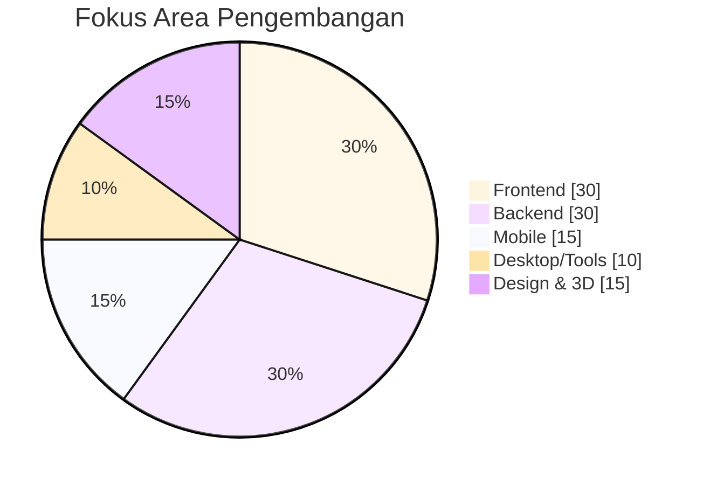
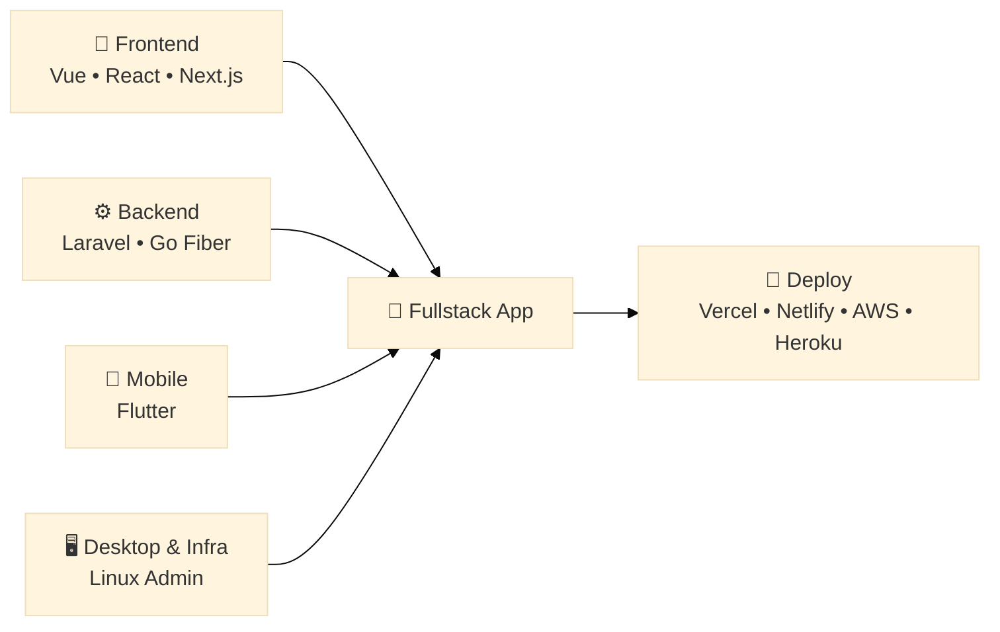
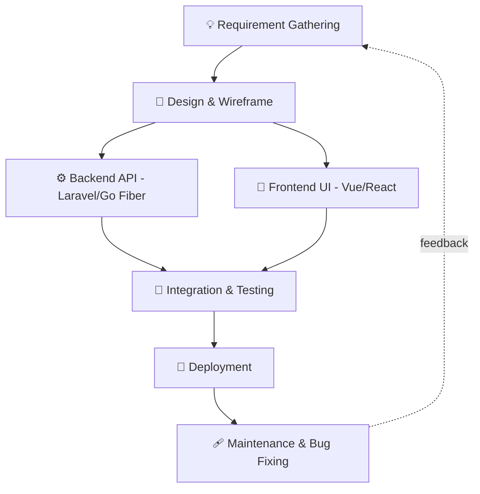

  

  

<h1 align="center">Hey there! 👋 I'm Arif</h1>

<em>Fullstack Web Developer • Clinic & ERP Systems • UI/UX Enthusiast</em>

  
  

---

## 🪪 Identitas

<table align="center" width="100%">
  <tr>
    <td width="30%"><strong>Nama Lengkap</strong></td>
    <td width="70%">Arif Permana Putrasuryana</td>
  </tr>
  <tr>
    <td><strong>Peran</strong></td>
    <td>Fullstack Web Developer</td>
  </tr>
  <tr>
    <td><strong>Fokus Saat Ini</strong></td>
    <td>Clinic Management System & Internal ERP</td>
  </tr>
  <tr>
    <td><strong>Lokasi</strong></td>
    <td>Indonesia 🇮🇩</td>
  </tr>
  <tr>
    <td><strong>Bahasa</strong></td>
    <td>Bahasa Indonesia, English, 日本語 (dasar)</td>
  </tr>
  <tr>
    <td><strong>Portfolio</strong></td>
    <td><a href="https://arifpermana.vercel.app/" target="_blank">arifpermana.vercel.app</a></td>
  </tr>
  <tr>
    <td><strong>Support</strong></td>
    <td><a href="https://trakteer.id/itsmebroarif/tip?open=true" target="_blank">trakteer.id/itsmebroarif</a></td>
  </tr>
</table>

---

## 💫 About Me

<table align="center" width="100%">
  <tr>
    <td width="60%" valign="top">
      <ul style="list-style: none; padding: 0;">
        <li>🔭 <strong>Currently Working:</strong> Fullstack Web Developer crafting modern web experiences</li>
        <li>🌱 <strong>Learning:</strong> Advanced JavaScript patterns & Modern web architectures</li>
        <li>🤝 <strong>Passionate About:</strong> Fullstack Web Development & UI/UX Design</li>
        <li>💬 <strong>Ask Me About:</strong> Web & App Development, Design, or anything tech-related</li>
        <li>⚡ <strong>Fun Fact:</strong> I love solving complex problems with elegant solutions</li>
      </ul>
    </td>
    <td width="40%" align="center" valign="middle">
      
    </td>
  </tr>
</table>

---

## 📊 Skill Distribution

---

## 🧠 Skill Matrix

### 🎨 Frontend
| Skill | Tools / Framework | Level |
|---|---|---|
| UI Development | Vue 2/3, React, Next.js | ⭐⭐⭐⭐⭐ |
| Styling | Tailwind, Quasar, Vuetify, Bootstrap | ⭐⭐⭐⭐⭐ |
| State Management | Vuex, Pinia, Redux | ⭐⭐⭐⭐ |
| Markup | HTML5, CSS3, SVG Animation | ⭐⭐⭐⭐⭐ |

### ⚙️ Backend
| Skill | Tools / Framework | Level |
|---|---|---|
| API Development | Laravel, Go Fiber | ⭐⭐⭐⭐⭐ |
| Database | MariaDB, MongoDB | ⭐⭐⭐⭐ |
| Auth & Security | JWT, Sanctum, Session-based | ⭐⭐⭐⭐ |
| Server Language | PHP, Go, Python, Java | ⭐⭐⭐⭐ |

### 📱 Mobile
| Skill | Tools / Framework | Level |
|---|---|---|
| Cross-platform App | Flutter (Dart) | ⭐⭐⭐⭐ |
| PWA Development | Vue/Quasar PWA | ⭐⭐⭐⭐⭐ |
| Responsive Design | Mobile-first UI | ⭐⭐⭐⭐⭐ |

### 🖥️ Desktop & Tools
| Skill | Tools / Framework | Level |
|---|---|---|
| System Administration | Linux Admin/Support, Windows, macOS | ⭐⭐⭐⭐ |
| Design & Prototyping | Photoshop, Illustrator, Adobe XD, Canva | ⭐⭐⭐⭐ |
| Animation & 3D | Aseprite, Adobe Animate, Blender, Voxel Studio | ⭐⭐⭐⭐ |
| Cloud & Deployment | AWS, Vercel, Netlify, Firebase, Heroku | ⭐⭐⭐⭐ |

---

## 🛠️ Tech Stack

### 🚀 Core Programming Languages

  
  
  
  
  
  
  
  

### 🌐 Frameworks & Libraries

  
  
  
  
  

### 🗄️ Database & Cloud Platforms

  
  
  
  
  
  
  

### 🎨 Design & UI/UX Tools

  
  
  
  

### ✨ Animation & 3D Creation

  
  
  
  

### 🛠️ System Administration & IT Support

  
  
  
  

### 🗣️ Languages Spoken

  
  
  

---

## 🗺️ How I Build a Project

---

## 🌟 Featured Projects

Beberapa aplikasi yang sudah saya buat dan bisa langsung dicoba secara online 👇

<table align="center" width="100%">
  <tr>
    <th align="left">Project</th>
    <th align="left">Deskripsi</th>
    <th align="center">Demo</th>
  </tr>
  <tr>
    <td>🗂️ <strong>RajinKerja</strong></td>
    <td>Aplikasi produktivitas & manajemen pekerjaan harian.</td>
    <td align="center">
      
    </td>
  </tr>
  <tr>
    <td>📊 <strong>E-Rekap</strong></td>
    <td>Aplikasi rekapitulasi data secara digital.</td>
    <td align="center">
      
    </td>
  </tr>
  <tr>
    <td>💵 <strong>Cashy</strong></td>
    <td>Aplikasi pencatatan & pengelolaan keuangan pribadi.</td>
    <td align="center">
      
    </td>
  </tr>
  <tr>
    <td>🎉 <strong>17an Bojonglio</strong></td>
    <td>PWA manajemen lomba 17 Agustus — registrasi peserta, sistem antrean, penilaian, hingga leaderboard.</td>
    <td align="center">
      
    </td>
  </tr>
</table>

> 💡 *Deskripsi di atas masih draft singkat — silakan sesuaikan dengan detail fitur masing-masing aplikasi.*

---

## 💰 Support & Sponsorship

Jika kamu ingin mendukung perkembangan proyek yang saya buat, kamu bisa memberikan donasi melalui platform berikut:

  
  

---

  

