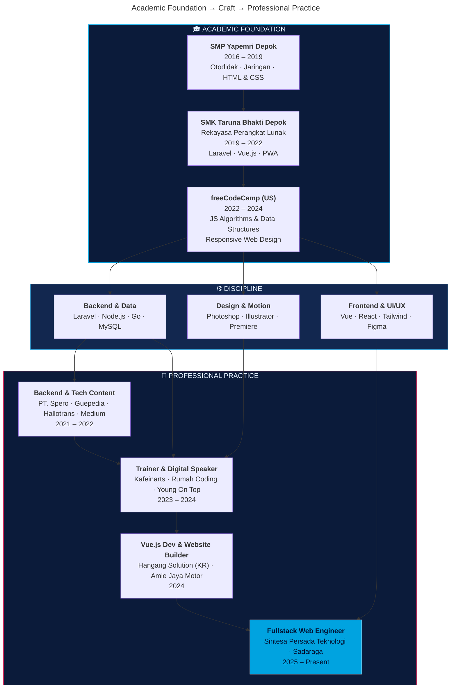
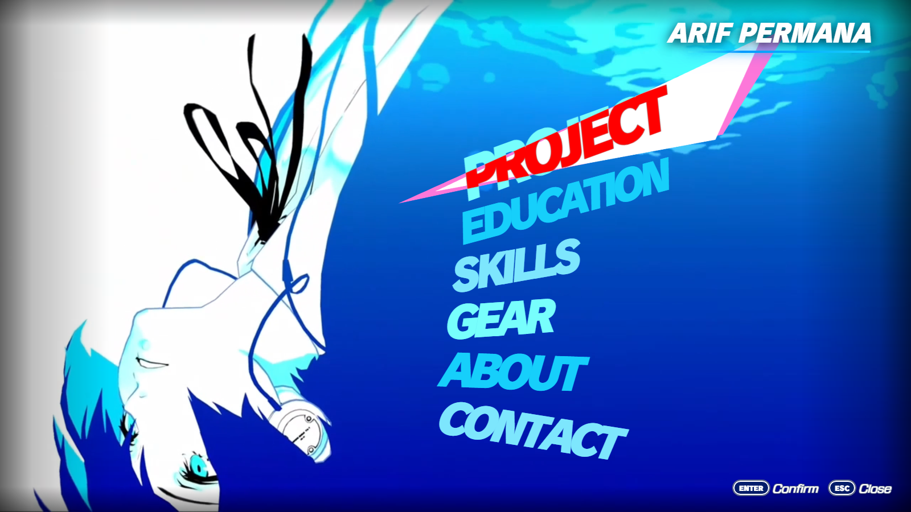

<div align="center">


# ✦ ARIF PERMANA PUTRASURYANA ✦

### *Fullstack Web Developer · UI/UX Designer · Graphic Designer*


<br>


<br>

[**🌐 Visit Portfolio**](https://itsmebroarif.github.io/itsmebroarif/)
 · [**✉️ Email**](mailto:aripstrike@gmail.com)
 · [**💼 LinkedIn / Instagram**](https://www.instagram.com/eexxvvn/)
 · [**📚 Project Documentation**](docs/PORTFOLIO.md)

</div>

---

<div align="center">

> ### *"Talk is cheap. Show me the code."*
> <sub>— Linus Torvalds, the line I build my career on</sub>

</div>

---

## 📖 Biography

**Arif Permana Putrasuryana** is a fullstack web developer and UI/UX designer based in **Depok, West Java, Indonesia**, with more than **four years of professional practice** spanning frontend engineering, backend architecture, interface design, and digital training. He began writing HTML and CSS as a self-taught student, formalised that craft through vocational study in **Rekayasa Perangkat Lunak (Software Engineering)**, and completed a two-year web development programme at **freeCodeCamp (San Francisco, USA)** — a path that shaped a working method grounded in clarity, structure, and measurable outcomes.

His practice deliberately unites two disciplines that are often separated: **the functional discipline of software engineering** and **the aesthetic discipline of interface design**. Working across **Vue.js, React, Laravel, Node.js, Go, MySQL**, and **Figma**, he delivers production websites, registration and reporting systems, REST APIs, and internal tools — and has additionally served as a trainer for HTML, CSS, JavaScript, Vue.js, and Laravel cohorts. Beyond engineering he handles visual identity, video editing, and hardware maintenance, giving him end-to-end ownership of the products he ships.

Currently engaged as a **Fullstack Web Engineer** at **Sintesa Persada Teknologi** and **Sadaraga**, he is selectively open to new collaborations, freelance commissions, and full-time opportunities.

---

## 📍 At a Glance

| | |
|---|---|
| **Full Name** | Arif Permana Putrasuryana |
| **Professional Title** | Fullstack Web Developer & UI/UX Designer |
| **Location** | Depok, West Java, Indonesia · GMT+7 |
| **Experience** | 5+ years — engineering, training & freelance (since 2021) |
| **Core Stack** | Vue.js · React · Laravel · Node.js · Go · MySQL |
| **Design Stack** | Figma · Adobe XD · Photoshop · Illustrator · Premiere Pro |
| **Languages** | Bahasa Indonesia (native) · English (professional) |
| **Education** | freeCodeCamp (US) · SMK Taruna Bhakti Depok — RPL |
| **Status** | ✅ Ready to work · Remote or on-site |
| **Availability** | Full-time · Contract · Freelance · Consulting |

---

## 🧭 Professional Journey


```mermaid
---
title: Academic Foundation → Craft → Professional Practice
---
flowchart TD
    subgraph foundation["🎓 ACADEMIC FOUNDATION"]
        A["<b>SMP Yapemri Depok</b><br/>2016 – 2019<br/>Otodidak · Jaringan · HTML & CSS"]
        B["<b>SMK Taruna Bhakti Depok</b><br/>Rekayasa Perangkat Lunak<br/>2019 – 2022<br/>Laravel · Vue.js · PWA"]
        C["<b>freeCodeCamp (US)</b><br/>2022 – 2024<br/>JS Algorithms & Data Structures<br/>Responsive Web Design"]
        A --> B --> C
    end

    subgraph craft["⚙️ DISCIPLINE"]
        D["<b>Frontend & UI/UX</b><br/>Vue · React · Tailwind · Figma"]
        E["<b>Backend & Data</b><br/>Laravel · Node.js · Go · MySQL"]
        F["<b>Design & Motion</b><br/>Photoshop · Illustrator · Premiere"]
    end

    subgraph practice["💼 PROFESSIONAL PRACTICE"]
        G["<b>Backend & Tech Content</b><br/>PT. Spero · Guepedia · Hallotrans · Medium<br/>2021 – 2022"]
        H["<b>Trainer & Digital Speaker</b><br/>Kafeinarts · Rumah Coding · Young On Top<br/>2023 – 2024"]
        I["<b>Vue.js Dev & Website Builder</b><br/>Hangang Solution (KR) · Amie Jaya Motor<br/>2024"]
        J["<b>Fullstack Web Engineer</b><br/>Sintesa Persada Teknologi · Sadaraga<br/>2025 – Present"]
        G --> H --> I --> J
    end

    C --> D
    C --> E
    C --> F
    D --> J
    E --> G
    E --> H
    F --> H

    style foundation fill:#0B1B3A,stroke:#00A3E0,color:#E6F1FF
    style craft fill:#12274F,stroke:#4FC3F7,color:#E6F1FF
    style practice fill:#0B1B3A,stroke:#FF2A5F,color:#E6F1FF
    style J fill:#00A3E0,stroke:#ffffff,color:#001233
```

---

## 💼 Experience

| Period | Role | Organisations | Focus |
|:-:|---|---|---|
| **2025 — Present** | Fullstack Web Engineer | Sintesa Persada Teknologi · Sadaraga | Company websites, marathon registration & result-serving systems, BIB checking (C#) |
| **2024** | Vue.js Dev & Website Builder | Hangang Solution (Republic of Korea) · Amie Jaya Motor | Game-developer learning site & forum; static dealer website linked to Yamaha's official site |
| **2023 — 2024** | Trainer & Digital Speaker | Kafeinarts · Rumah Coding · Young On Top | HTML, CSS, JavaScript, Vue.js, Bootstrap; Laravel, Blade, MVC, OOP, CRUD; digital advertising |
| **2021 — 2022** | Backend & Tech Content | PT. Spero Mahakarya Nusantara · Guepedia · Hallotrans · Medium | REST API management, frontend collaboration, Laravel/Vue.js applications, web-app maintenance, hardware & software reviews |

<details>
<summary><b>📄 Detailed project descriptions</b></summary>

- **Sintesa Persada Teknologi & Sadaraga** — company website development, marathon registration systems, participant result serving, and BIB checking built on C#.
- **Hangang Solution (KR)** — website and learning forum for game developers. **Amie Jaya Motor** — static Yamaha dealer website connected to the official site.
- **Kafeinarts** — teaching HTML, CSS, JavaScript, Vue.js, Bootstrap. **Rumah Coding** — mentoring Laravel, Blade, MVC, OOP, CRUD. **Young On Top** — digital advertising education.
- **PT. Spero** — REST API management and frontend collaboration. **Guepedia** — Laravel and Vue.js applications. **Hallotrans** — web application maintenance. **Medium** — hardware and software reviews.

</details>

---

## 🎓 Education

| Period | Institution | Programme | Highlights |
|:-:|---|---|---|
| **2022 — 2024** | **freeCodeCamp** (San Francisco, USA) | Web Developer Bootcamp | Responsive website design, JavaScript algorithms & data structures |
| **2019 — 2022** | **SMK Taruna Bhakti Depok** | Rekayasa Perangkat Lunak (Software Engineering) | Website & application development with Laravel, Vue.js, PWA |
| **2016 — 2019** | **SMP Yapemri Depok** | Junior High School | Self-taught computer networking & introductory HTML/CSS |

### 📜 Certifications

| Year | Certification |
|:-:|---|
| 2025 | JavaScript Course Contributor |
| 2025 | Golang Course Contributor |
| 2025 | Digital Advertising |
| 2024 | Flutter Course Contributor |
| 2024 | freeCodeCamp — JavaScript Algorithms & Data Structures |
| 2024 | freeCodeCamp — Responsive Web Design |

---

## 🧰 Technical Arsenal

### Frontend

| Technology | Level | Focus |
|---|:-:|---|
| HTML5 · CSS3 · JavaScript (ES6+) | 95% | Semantic markup, modern layout, modern syntax |
| Vue.js · React | 90% | Component architecture & stateful interfaces |
| Bootstrap · Tailwind CSS · Livewire | 92% | Design systems and rapid UI delivery |
| Responsive Design · PWA | 88% | Mobile-first layouts, offline-capable apps |
| UI/UX Design · Figma · Adobe XD | 86% | Wireframe → prototype → hand-off |
| JavaScript Algorithms & Data Structures | 85% | Problem solving & code quality |

### Backend & Tooling

| Technology | Level | Focus |
|---|:-:|---|
| PHP · Laravel · MVC & OOP | 95% | Structured, maintainable server-side applications |
| MySQL · MariaDB | 92% | Schema design, query optimisation |
| Node.js · REST API · WebSockets | 88% | HTTP services and real-time features |
| Git · GitHub · GitLab | 90% | Version control & collaborative workflows |
| NPM · Composer · Electron.js | 86% | Dependency management & desktop packaging |
| Go (Golang) · Python | 84% | Services, automation, general-purpose scripting |

### Design, Media & Systems

| Tool / System | Level |
|---|:-:|
| Microsoft Office (Word · Excel · PowerPoint) | 92% |
| Adobe Photoshop | 90% |
| Adobe Illustrator | 88% |
| Windows · macOS · Linux (Ubuntu · Arch) | 88% |
| Affinity Designer · Canva | 86% |
| Adobe Premiere Pro · CapCut · Sony Vegas | 84% |

---

## 🌐 Languages

| Language | Proficiency | Applied In |
|---|:-:|---|
| **Bahasa Indonesia** | 🟩🟩🟩🟩🟩 Native / Fluent | Documentation, teaching, client communication |
| **English — Technical & Documentation** | 🟩🟩🟩🟩⬜ Advanced (86%) | Code, API docs, technical specifications |
| **English — Writing & Documentation** | 🟩🟩🟩🟩⬜ Advanced (82%) | Articles, documentation, knowledge bases |
| **English — Spoken & Conversational** | 🟩🟩🟩⬜⬜ Upper-Intermediate (78%) | Meetings, presentations, daily discussion |

---

## ⚙️ Workflow

Every change that lands on `main` is verified automatically before it reaches visitors.

| Check | Tool | Purpose |
|---|---|---|
| JavaScript syntax | `node --check js/main.js` | Guarantees the interaction engine never breaks silently |
| Required assets | Shell gate | HTML, CSS, JS, media, fonts and documentation must all be present |
| Internal references | Link resolver | Every `href`/`src` in `index.html` must resolve to a real file |

```text
push / pull request
        │
        ▼
┌───────────────────┐   ┌────────────────────┐   ┌──────────────────────┐
│  Syntax check     │──▶│  Assets check      │──▶│  Internal link check │
│  node --check     │   │  media · fonts     │   │  href/src resolution │
└───────────────────┘   └────────────────────┘   └──────────────────────┘
        │                          │                         │
        └──────────────────────────┴─────────────────────────┘
                                   │
                                   ▼
                        ✅ GitHub Pages deploy
```


**Conventions:** conventional, descriptive commit messages · relative asset paths (portable to any sub-path or domain) · cache-busted `css`/`js` versions on release · zero build step, zero framework.

---

## 🖥️ Workspace

| Device | Model | Role |
|---|---|---|
| Monitor | **LG 19EN33S** | Primary display — coding, design, previewing builds |
| Laptop | **Lenovo Y410P** | Development workstation & daily driver |
| Keyboard | **Leaven K550** | Mechanical — long coding sessions |
| Mouse | **Rexus Q35** | Design navigation & productivity |
| Earphone | **Hammerhead V1** | Meetings, reviews, client calls |

---

## 📊 GitHub Profile

<div align="center">


</div>

---

## ✦ Featured Project — *Persona 3 Reload Portfolio*

<a href="https://itsmebroarif.github.io/itsmebroarif/">
  
</a>

A **menu-driven, single-page portfolio** engineered with plain HTML, CSS and JavaScript — no framework, no build step.

- 🎴 Nine-section slanted main menu — **Project · Store · Mini Games · Education · Organization · Skills · Gear · About · Contact**
- 🎬 Dedicated background video per section with preloading
- 🎵 Original audio design: looping backsound with fade-in, plus menu and navigation SFX
- 🃏 Skewed card-stack sub-pages with auto-scroll and selection tracking
- 🛍️ Store section with a `PRODUCT` menu — 16 illustrated, category-filterable products (ERP, SIMRS, LMS, POS, HRIS, e-commerce, QR menu …) ready to order
- 🕹️ **Mini Games arcade** — four playable **three.js** 3D games inside the page (*Shadow Dodge*, *Evoker Target*, *Block Breaker*, *Ring Rush*) with a live HUD, attract mode, procedural SFX and saved best scores
- ⚔️ Persona-style skill screen — skill groups presented as Personas (Orpheus, Thanatos, Orpheus Telos, Messiah) with element-typed chips and fully readable skill names
- ⌨️ Keyboard-first navigation and routable deep links (`?page=…`, e.g. `?page=minigame&game=ring-rush`)
- 🌐 Cross-browser audio recovery (Chrome, Firefox) with a desktop-first notice for small screens

**Live:** [itsmebroarif.github.io/itsmebroarif](https://itsmebroarif.github.io/itsmebroarif/) · **Docs:** [docs/PORTFOLIO.md](docs/PORTFOLIO.md) · **Source:** this repository

---

## 📬 Contact

| Channel | Detail | For |
|---|---|---|
| ✉️ **Email** | [aripstrike@gmail.com](mailto:aripstrike@gmail.com) | Projects, collaboration, career opportunities |
| 💬 **Discord** | `itsmebroarif` | Fast coordination & technical discussion |
| 📸 **Instagram** | [@eexxvvn](https://www.instagram.com/eexxvvn/) | Visual work, design archive, latest updates |
| 📞 **Phone / WhatsApp** | [+62 858-1704-8244](tel:+6285817048244) | Consultation & service enquiries |
| 🐙 **GitHub** | [@itsmebroarif](https://github.com/itsmebroarif) | Source code & contributions |
| 🌐 **Portfolio** | [itsmebroarif.github.io/itsmebroarif](https://itsmebroarif.github.io/itsmebroarif/) | Selected work & case studies |

---

## 📜 Colophon

- **Design direction** inspired by *Persona 3 Reload* (ATLUS / SEGA) — an original, non-commercial homage built for this portfolio.
- This profile and portfolio are **personal, non-commercial projects**; they are not affiliated with, endorsed by, or sponsored by ATLUS or SEGA, and contain no extracted game assets.
- **Typefaces:** Poppins (Google Fonts) · Rodin Pro · Skip.
- Set in **Poppins** and **Rodin Pro**, engineered with vanilla JavaScript, hosted on GitHub Pages.

<div align="center">

**© 2026 Arif Permana Putrasuryana — All rights reserved.**

✦ *Open the Door.* ✦

</div>
